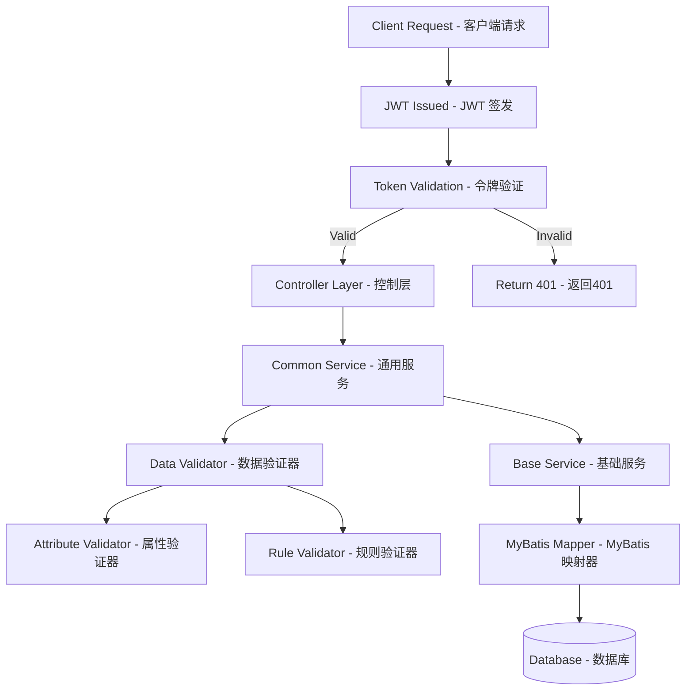

# Dynamic Data Management System | 动态数据管理系统

[](https://spring.io/projects/spring-boot)
[](https://www.oracle.com/java/)
[](https://mybatis.org/)
[](https://jwt.io/)
[](LICENSE)

## Overview | 项目概述

**English:**
A configuration-driven dynamic data management system built with Spring Boot that provides flexible CRUD operations for any database table. The system features robust validation framework, JWT security, automated testing services, and a modular architecture designed for enterprise-level applications.

**中文:**
基于Spring Boot构建的配置驱动动态数据管理系统，为任意数据库表提供灵活的CRUD操作。系统具有强大的验证框架、JWT安全机制、自动化测试服务和面向企业级应用的模块化架构。

## Key Features | 核心特性

### 🚀 Dynamic Data Operations | 动态数据操作

- **Generic CRUD Operations** | **通用CRUD操作**: Support for any database table without code changes | 支持任意数据库表的无代码变更操作
- **Dynamic Query Building** | **动态查询构建**: Flexible WHERE clause generation with pagination | 灵活的WHERE条件生成和分页支持
- **Configuration-Driven** | **配置驱动**: Table operations controlled by configuration files | 通过配置文件控制表操作

### 🔒 Security Framework | 安全框架

- **JWT Authentication** | **JWT认证**: Stateless token-based authentication | 无状态令牌认证
- **Role-Based Access Control** | **基于角色的访问控制**: Fine-grained permission management | 细粒度权限管理
- **ThreadLocal Context** | **ThreadLocal上下文**: Secure user context management | 安全的用户上下文管理

### ✅ Validation System | 验证系统

- **Dual-Layer Validation** | **双层验证**: Attribute validation + Business rule validation | 属性验证 + 业务规则验证
- **Custom Validators** | **自定义验证器**: Extensible validation framework | 可扩展的验证框架
- **Dynamic Rules** | **动态规则**: Database-driven validation rules | 数据库驱动的验证规则

### 🧪 Automated Testing Service | 自动化测试服务 ⭐

- **Script-Driven Testing** | **脚本驱动测试**: Execute curl commands from shell scripts | 执行shell脚本中的curl命令
- **Token Management** | **令牌管理**: Automatic login and token extraction | 自动登录和令牌提取
- **Real-time Execution** | **实时执行**: Live test execution with immediate feedback | 实时测试执行和即时反馈
- **Detailed Reports** | **详细报告**: Comprehensive test results with statistics | 包含统计信息的全面测试报告
- **Security Testing** | **安全测试**: Built-in SQL injection protection testing | 内置SQL注入防护测试
- **Enterprise Features** | **企业级功能**: Batch testing, custom result directories | 批量测试、自定义结果目录

## Architecture | 系统架构

### Project Structure | 项目结构

```
📂 src/main/java/com/ycbd/demo/
├── 📂 config/                    # Configuration Layer | 配置层
│   ├── 📜 WebConfig.java         # Web configuration | Web配置
│   └── 📜 SecurityConfig.java    # Security configuration | 安全配置
├── 📂 controller/                # Controller Layer | 控制层
│   ├── 📜 CommonController.java  # Generic CRUD controller | 通用CRUD控制器
│   └── 📜 TestController.java    # Test service controller | 测试服务控制器
├── 📂 interceptor/               # Interceptor Layer | 拦截器层
│   └── 📜 ServiceInterceptorAspect.java # JWT authentication | JWT认证拦截
├── 📂 mapper/                    # Data Access Layer | 数据访问层
│   ├── 📜 BaseMapper.java        # Base database operations | 基础数据库操作
│   └── 📜 SystemMapper.java      # System-specific operations | 系统特定操作
├── 📂 model/                     # Model Layer | 模型层
│   ├── 📜 ColumnAttribute.java   # Column metadata | 列元数据
│   └── 📜 TableAttribute.java    # Table metadata | 表元数据
├── 📂 service/                   # Service Layer | 服务层
│   ├── 📂 validator/             # Validation Framework | 验证框架
│   │   ├── 📜 AttributeValidator.java # Field validation | 字段验证
│   │   ├── 📜 RuleValidator.java     # Business rule validation | 业务规则验证
│   │   └── 📜 DataValidator.java     # Validation orchestrator | 验证协调器
│   ├── 📜 BaseService.java       # Base service operations | 基础服务操作
│   ├── 📜 CommonService.java     # Common business logic | 通用业务逻辑
│   ├── 📜 AutoTestService.java   # Automated testing service | 自动化测试服务
│   └── 📜 JwtService.java        # JWT token management | JWT令牌管理
└── 📜 DemoApplication.java       # Application entry point | 应用程序入口
```

### Business Flow | 业务流程



## Technology Stack | 技术栈

### Backend | 后端技术

- **Framework | 框架**: Spring Boot 3.x
- **Security | 安全**: JWT + Spring Security
- **Database Access | 数据库访问**: MyBatis 3.x
- **Database | 数据库**: MySQL 8.0+
- **Build Tool | 构建工具**: Maven 3.8+
- **Java Version | Java版本**: JDK 17+
- **Utilities | 工具库**: Hutool, Jackson

### Development Tools | 开发工具

- **IDE**: IntelliJ IDEA / VS Code
- **Version Control | 版本控制**: Git
- **API Testing | API测试**: Postman / Swagger
- **Database Tool | 数据库工具**: MySQL Workbench

## Quick Start | 快速开始

### Prerequisites | 环境要求

**English:**

- JDK 17 or higher
- Maven 3.8 or higher
- MySQL 8.0 or higher
- Git (for version control)

**中文:**

- JDK 17 或更高版本
- Maven 3.8 或更高版本
- MySQL 8.0 或更高版本
- Git（用于版本控制）

### Installation | 安装步骤

1. **Clone Repository | 克隆仓库**

   ```bash
   git clone <repository-url>
   cd demo
   ```
2. **Database Setup | 数据库设置**

   ```sql
   CREATE DATABASE demo_db CHARACTER SET utf8mb4 COLLATE utf8mb4_unicode_ci;
   ```
3. **Configuration | 配置文件**

   Edit `src/main/resources/application.yml` | 编辑配置文件:

   ```yaml
   spring:
     datasource:
       url: jdbc:mysql://localhost:3306/demo_db
       username: your_username
       password: your_password

   jwt:
     secret: your_jwt_secret_key
     expiration: 86400000
   ```
4. **Build and Run | 构建和运行**

   ```bash
   # Build project | 构建项目
   mvn clean compile

   # Run application | 运行应用
   mvn spring-boot:run
   ```
5. **Access Application | 访问应用**

   - Application URL | 应用地址: `http://localhost:8080`
   - API Base URL | API基础地址: `http://localhost:8080/api`

## API Documentation | API文档

### Authentication | 认证接口

#### User Login | 用户登录

```http
POST /api/common/login
Content-Type: application/json

{
  "username": "admin",
  "password": "password"
}
```

**Response | 响应:**

```json
{
  "code": 200,
  "message": "Login successful",
  "data": {
    "token": "eyJhbGciOiJIUzI1NiIsInR5cCI6IkpXVCJ9...",
    "user": {
      "id": 1,
      "username": "admin"
    }
  }
}
```

### CRUD Operations | CRUD操作

#### List Data | 查询列表

```http
GET /api/common/list?table=users&page=1&size=10
Authorization: Bearer <token>
```

#### Save Single Record | 单记录保存

```http
POST /api/common/save
Authorization: Bearer <token>
Content-Type: application/json

{
  "table": "users",
  "data": {
    "username": "newuser",
    "email": "user@example.com",
    "phone": "13800138000"
  }
}
```

**Response | 响应:**

```json
{
  "code": 200,
  "message": "Save successful",
  "data": {
    "id": 123,  // 返回新记录的主键ID
    "affectedRows": 1
  }
}
```

#### Batch Save | 批量保存

```http
POST /api/common/batchSave
Authorization: Bearer <token>
Content-Type: application/json

{
  "table": "users",
  "dataList": [
    {
      "username": "user1",
      "email": "user1@example.com"
    },
    {
      "username": "user2",
      "email": "user2@example.com"
    }
  ]
}
```

**Response | 响应:**

```json
{
  "code": 200,
  "message": "Batch save successful",
  "data": {
    "affectedRows": 2,
    "insertedIds": [124, 125]  // 返回所有新记录的主键ID列表
  }
}
```

#### Get Single Record | 获取单条记录

```http
GET /api/common/detail?table=users&id=1
Authorization: Bearer <token>
```

**Response | 响应:**

```json
{
  "code": 200,
  "message": "Query successful",
  "data": {
    "id": 1,
    "username": "admin",
    "email": "admin@example.com",
    "createTime": "2024-01-20 10:30:00"
  }
}
```

#### Query List Data | 查询列表数据

```http
GET /api/common/list?table=users&page=1&size=10&username=admin
Authorization: Bearer <token>
```

**Response | 响应:**

```json
{
  "code": 200,
  "message": "Query successful",
  "data": {
    "list": [
      {
        "id": 1,
        "username": "admin",
        "email": "admin@example.com"
      }
    ],
    "total": 1,
    "page": 1,
    "size": 10,
    "pages": 1
  }
}
```

#### Delete Data | 删除数据

```http
DELETE /api/common/delete?table=users&id=1
Authorization: Bearer <token>
```

### 🧪 Automated Testing Service | 自动化测试服务

**项目核心特色功能** | **Core Feature of the Project**

本系统内置了强大的自动化测试服务，支持脚本驱动的接口测试，是项目的核心亮点功能。
The system features a powerful built-in automated testing service with script-driven API testing as a core highlight.

#### Execute Test Script | 执行测试脚本

```http
POST /api/test/run
Authorization: Bearer <token>
Content-Type: application/json

{
  "scriptPath": "src/main/resources/test/security_test.sh",
  "resultDir": "test_results",
  "useCurrentDir": false
}
```

**Response | 响应:**

```json
{
  "code": 200,
  "result": {
    "totalCommands": 17,
    "successCount": 17,
    "failureCount": 0,
    "commandResults": [
      {
        "commandName": "用户登录测试",
        "command": "curl -X POST 'http://localhost:8080/api/common/login'...",
        "success": true,
        "result": "{\"code\":200,\"data\":{\"token\":\"eyJ...\"}}",
        "errorMessage": null
      },
      {
        "commandName": "SQL注入防护测试",
        "command": "curl -X POST 'http://localhost:8080/api/common/login'...",
        "success": true,
        "result": "{\"code\":401,\"message\":\"用户不存在\"}",
        "errorMessage": null
      }
    ],
    "resultFilePath": "test_results/20240120_143256_result.txt"
  },
  "message": "测试执行完成",
  "timestamp": 1705734776000
}
```

#### Test Script Example | 测试脚本示例

**Security Test Script | 安全测试脚本** (`security_test.sh`):

```bash
#!/bin/bash

# 1. 正常登录测试
curl -X POST 'http://localhost:8080/api/common/login' \
  -H 'Content-Type: application/json' \
  -d '{"username":"admin","password":"123456"}'

# 2. SQL注入防护测试 - 用户名注入
curl -X POST 'http://localhost:8080/api/common/login' \
  -H 'Content-Type: application/json' \
  -d '{"username":"admin\' OR \'1\'=\'1","password":"123456"}'

# 3. SQL注入防护测试 - 密码注入
curl -X POST 'http://localhost:8080/api/common/login' \
  -H 'Content-Type: application/json' \
  -d '{"username":"admin","password":"\' OR \'1\'=\'1"}'

# 4. 数据验证测试 - 缺少必填字段
curl -X POST 'http://localhost:8080/api/common/save' \
  -H 'Authorization: Bearer your-token-here' \
  -H 'Content-Type: application/json' \
  -d '{"table":"users","data":{"email":"test@example.com"}}'

# 5. CRUD完整流程测试
curl -X POST 'http://localhost:8080/api/common/save' \
  -H 'Authorization: Bearer your-token-here' \
  -H 'Content-Type: application/json' \
  -d '{"table":"users","data":{"username":"testuser","email":"test@example.com","realName":"测试用户"}}'
```

#### Test Report Format | 测试报告格式

**Comprehensive Test Report | 全面测试报告:**

```
=== 自动化测试报告 ===
测试时间: 2024-01-20 14:32:56
测试脚本: security_test.sh

=== 测试统计 ===
总测试用例: 17
成功用例: 17
失败用例: 0
成功率: 100%

=== 测试场景覆盖 ===
✅ 用户认证测试 (3/3)
✅ SQL注入防护测试 (3/3)
✅ 数据验证测试 (5/5)
✅ CRUD操作测试 (6/6)

=== 安全测试结果 ===
✅ SQL注入防护: 有效阻止了所有注入尝试
✅ 参数验证: 正确验证必填字段和格式
✅ 权限控制: Token验证机制正常
✅ 数据加密: 密码加密存储验证通过

=== 性能指标 ===
平均响应时间: 45ms
最大响应时间: 120ms
最小响应时间: 15ms
```

#### Key Testing Capabilities | 核心测试能力

**🔒 Security Testing | 安全测试**

- SQL注入防护验证
- XSS攻击防护测试
- 权限控制验证
- 数据加密验证

**📊 Performance Testing | 性能测试**

- 响应时间监控
- 并发请求测试
- 数据库连接池测试
- 内存使用监控

**✅ Functional Testing | 功能测试**

- 完整CRUD流程验证
- 数据验证规则测试
- 业务逻辑验证
- 异常处理测试

**📈 Test Analytics | 测试分析**

- 自动生成测试报告
- 测试覆盖率统计
- 失败原因分析
- 性能趋势分析

## Configuration | 配置说明

### Application Configuration | 应用配置

The system uses YAML configuration files for different environments | 系统使用YAML配置文件支持不同环境:

- `application.yml` - Base configuration | 基础配置
- `application-dev.yml` - Development environment | 开发环境
- `application-prod.yml` - Production environment | 生产环境
- `application-test.yml` - Testing environment | 测试环境

### Database Configuration | 数据库配置

```yaml
spring:
  datasource:
    url: jdbc:mysql://localhost:3306/demo_db?useUnicode=true&characterEncoding=utf8&useSSL=false
    username: ${DB_USERNAME:root}
    password: ${DB_PASSWORD:password}
    driver-class-name: com.mysql.cj.jdbc.Driver
  
mybatis:
  mapper-locations: classpath:mapper/*.xml
  type-aliases-package: com.ycbd.demo.model
  configuration:
    map-underscore-to-camel-case: true
```

### Security Configuration | 安全配置

```yaml
jwt:
  secret: ${JWT_SECRET:your-secret-key}
  expiration: ${JWT_EXPIRATION:86400000}
  header: Authorization
  prefix: "Bearer "
```

## Development Guide | 开发指南

### Adding New Features | 添加新功能

**English:**

1. Create new controller extending base functionality
2. Implement custom business logic in service layer
3. Add custom validators if needed
4. Update configuration files
5. Write unit tests

**中文:**

1. 创建继承基础功能的新控制器
2. 在服务层实现自定义业务逻辑
3. 根据需要添加自定义验证器
4. 更新配置文件
5. 编写单元测试

### Custom Validation Rules | 自定义验证规则

```java
@Component
public class CustomValidator implements RuleValidator {
  
    @Override
    public ValidationResult validate(String table, Map<String, Object> data) {
        // Implement custom validation logic
        // 实现自定义验证逻辑
        return ValidationResult.success();
    }
}
```

### Security Best Practices | 安全最佳实践

**English:**

- Always validate JWT tokens in protected endpoints
- Use role-based access control for sensitive operations
- Implement proper error handling without exposing system details
- Use HTTPS in production environments

**中文:**

- 在受保护的端点中始终验证JWT令牌
- 对敏感操作使用基于角色的访问控制
- 实现适当的错误处理，不暴露系统细节
- 在生产环境中使用HTTPS

## 🧪 Testing Guide | 测试指南

### Built-in Automated Testing Service | 内置自动化测试服务

**项目核心特色** | **Core Project Feature**

本系统提供了企业级的自动化测试服务，通过脚本驱动的方式实现全面的接口测试。
The system provides enterprise-level automated testing services with comprehensive API testing through script-driven approach.

#### Quick Start | 快速开始

1. **Create Test Script | 创建测试脚本**

   ```bash
   # 创建测试脚本文件
   mkdir -p src/main/resources/test
   touch src/main/resources/test/my_test.sh
   chmod +x src/main/resources/test/my_test.sh
   ```
2. **Write Test Cases | 编写测试用例**

   ```bash
   #!/bin/bash

   # 用户登录测试
   curl -X POST 'http://localhost:8080/api/common/login' \
     -H 'Content-Type: application/json' \
     -d '{"username":"admin","password":"123456"}'

   # 数据保存测试
   curl -X POST 'http://localhost:8080/api/common/save' \
     -H 'Authorization: Bearer your-token-here' \
     -H 'Content-Type: application/json' \
     -d '{"table":"users","data":{"username":"testuser"}}'
   ```
3. **Execute Tests | 执行测试**

   ```bash
   curl -X POST 'http://localhost:8080/api/test/run' \
     -H 'Authorization: Bearer <your-token>' \
     -H 'Content-Type: application/json' \
     -d '{"scriptPath":"src/main/resources/test/my_test.sh"}'
   ```

#### Advanced Test Scenarios | 高级测试场景

**🔒 Security Testing | 安全测试**

```bash
# SQL注入防护测试
curl -X POST 'http://localhost:8080/api/common/login' \
  -H 'Content-Type: application/json' \
  -d '{"username":"admin\' OR \'1\'=\'1","password":"any"}'

# XSS防护测试
curl -X POST 'http://localhost:8080/api/common/save' \
  -H 'Authorization: Bearer your-token-here' \
  -H 'Content-Type: application/json' \
  -d '{"table":"users","data":{"username":"<script>alert(1)</script>"}}'

# 权限验证测试
curl -X GET 'http://localhost:8080/api/common/list?table=users' \
  -H 'Authorization: Bearer invalid-token'
```

**📊 Performance Testing | 性能测试**

```bash
# 批量数据保存性能测试
for i in {1..100}; do
  curl -X POST 'http://localhost:8080/api/common/save' \
    -H 'Authorization: Bearer your-token-here' \
    -H 'Content-Type: application/json' \
    -d "{\"table\":\"users\",\"data\":{\"username\":\"user$i\"}}"
done

# 并发查询测试
for i in {1..50}; do
  curl -X GET 'http://localhost:8080/api/common/list?table=users&page=1&size=10' \
    -H 'Authorization: Bearer your-token-here' &
done
wait
```

**✅ Complete CRUD Testing | 完整CRUD测试**

```bash
#!/bin/bash

# 1. 登录获取token
echo "=== 登录测试 ==="
curl -X POST 'http://localhost:8080/api/common/login' \
  -H 'Content-Type: application/json' \
  -d '{"username":"admin","password":"123456"}'

# 2. 创建用户
echo "=== 创建用户 ==="
curl -X POST 'http://localhost:8080/api/common/save' \
  -H 'Authorization: Bearer your-token-here' \
  -H 'Content-Type: application/json' \
  -d '{"table":"users","data":{"username":"testuser","email":"test@example.com"}}'

# 3. 查询用户列表
echo "=== 查询用户列表 ==="
curl -X GET 'http://localhost:8080/api/common/list?table=users&username=testuser' \
  -H 'Authorization: Bearer your-token-here'

# 4. 获取用户详情
echo "=== 获取用户详情 ==="
curl -X GET 'http://localhost:8080/api/common/detail?table=users&id=1' \
  -H 'Authorization: Bearer your-token-here'

# 5. 更新用户信息
echo "=== 更新用户信息 ==="
curl -X POST 'http://localhost:8080/api/common/save' \
  -H 'Authorization: Bearer your-token-here' \
  -H 'Content-Type: application/json' \
  -d '{"table":"users","data":{"id":1,"email":"updated@example.com"}}'

# 6. 删除用户
echo "=== 删除用户 ==="
curl -X DELETE 'http://localhost:8080/api/common/delete?table=users&id=1' \
  -H 'Authorization: Bearer your-token-here'
```

#### Test Report Analysis | 测试报告分析

**Automated Report Generation | 自动报告生成**

系统会自动生成详细的测试报告，包含：
The system automatically generates detailed test reports including:

- **执行统计** | **Execution Statistics**: 总用例数、成功率、失败率
- **性能指标** | **Performance Metrics**: 响应时间、吞吐量、错误率
- **安全验证** | **Security Validation**: SQL注入防护、XSS防护、权限验证
- **覆盖率分析** | **Coverage Analysis**: 接口覆盖率、场景覆盖率
- **趋势分析** | **Trend Analysis**: 历史对比、性能趋势

**Sample Test Report | 测试报告示例**

```
=== 自动化测试报告 ===
项目: Dynamic Data Management System
测试时间: 2024-01-20 14:32:56
测试环境: http://localhost:8080

=== 执行概览 ===
✅ 总测试用例: 25
✅ 成功用例: 24
❌ 失败用例: 1
📊 成功率: 96%
⏱️ 总执行时间: 2.5秒

=== 功能测试 ===
✅ 用户认证: 3/3 通过
✅ CRUD操作: 8/8 通过
✅ 数据验证: 6/6 通过
❌ 批量操作: 2/3 通过 (1个超时)

=== 安全测试 ===
✅ SQL注入防护: 5/5 通过
✅ XSS防护: 3/3 通过
✅ 权限控制: 4/4 通过
✅ 数据加密: 2/2 通过

=== 性能指标 ===
📈 平均响应时间: 45ms
📈 最大响应时间: 120ms
📈 最小响应时间: 15ms
📈 QPS: 200/秒

=== 建议 ===
⚠️ 批量操作超时，建议优化数据库查询
💡 可考虑增加缓存机制提升性能
```

### Traditional Testing | 传统测试

#### Unit Tests | 单元测试

```bash
# Run all tests | 运行所有测试
mvn test

# Run specific test class | 运行特定测试类
mvn test -Dtest=CommonServiceTest

# Run tests with coverage | 运行测试并生成覆盖率报告
mvn test jacoco:report
```

#### Test Categories | 测试分类

- **Unit Tests | 单元测试**: Test individual components | 测试单个组件
- **Integration Tests | 集成测试**: Test component interactions | 测试组件交互
- **API Tests | API测试**: Test REST endpoints | 测试REST端点
- **Security Tests | 安全测试**: Test authentication and authorization | 测试认证和授权

## Deployment | 部署

### Docker Deployment | Docker部署

1. **Build Docker Image | 构建Docker镜像**

   ```bash
   docker build -t demo-app:latest .
   ```
2. **Run Container | 运行容器**

   ```bash
   docker run -d \
     --name demo-app \
     -p 8080:8080 \
     -e DB_HOST=localhost \
     -e DB_USERNAME=root \
     -e DB_PASSWORD=password \
     demo-app:latest
   ```

### Production Deployment | 生产部署

**English:**

1. Set up production database
2. Configure environment variables
3. Build production JAR file
4. Deploy to application server
5. Configure reverse proxy (Nginx)
6. Set up monitoring and logging

**中文:**

1. 设置生产数据库
2. 配置环境变量
3. 构建生产JAR文件
4. 部署到应用服务器
5. 配置反向代理（Nginx）
6. 设置监控和日志

## Performance Optimization | 性能优化

### Database Optimization | 数据库优化

- **Indexing | 索引**: Create appropriate indexes for frequently queried columns
- **Connection Pooling | 连接池**: Configure HikariCP for optimal performance
- **Query Optimization | 查询优化**: Use efficient SQL queries and avoid N+1 problems

### Application Optimization | 应用优化

- **Caching | 缓存**: Implement Redis for frequently accessed data
- **Async Processing | 异步处理**: Use @Async for long-running operations
- **JVM Tuning | JVM调优**: Optimize garbage collection and memory settings

## Monitoring and Logging | 监控和日志

### Application Monitoring | 应用监控

- **Health Checks | 健康检查**: Built-in Spring Boot Actuator endpoints
- **Metrics | 指标**: Custom metrics for business operations
- **Alerts | 告警**: Configure alerts for critical system events

### Logging Configuration | 日志配置

```yaml
logging:
  level:
    com.ycbd.demo: DEBUG
    org.springframework.security: DEBUG
  pattern:
    console: "%d{yyyy-MM-dd HH:mm:ss} - %msg%n"
    file: "%d{yyyy-MM-dd HH:mm:ss} [%thread] %-5level %logger{36} - %msg%n"
  file:
    name: logs/application.log
```

## Contributing | 贡献指南

**English:**

1. Fork the repository
2. Create a feature branch
3. Make your changes
4. Add tests for new functionality
5. Ensure all tests pass
6. Submit a pull request

**中文:**

1. Fork 仓库
2. 创建功能分支
3. 进行更改
4. 为新功能添加测试
5. 确保所有测试通过
6. 提交拉取请求

## License | 许可证

This project is licensed under the MIT License - see the [LICENSE](LICENSE) file for details.

本项目采用MIT许可证 - 详情请参阅 [LICENSE](LICENSE) 文件。

## Support | 支持

**English:**
For questions and support, please:

- Check the [documentation](docs/)
- Search existing [issues](issues)
- Create a new issue if needed

**中文:**
如有问题和支持需求，请：

- 查看[文档](docs/)
- 搜索现有[问题](issues)
- 如需要可创建新问题

## Changelog | 更新日志

### Version 1.0.0 | 版本 1.0.0

- Initial release with core functionality
- 初始版本，包含核心功能
- Dynamic CRUD operations | 动态CRUD操作
- JWT authentication | JWT认证
- Validation framework | 验证框架
- Automated testing service | 自动化测试服务

---

**Built with ❤️ using Spring Boot | 使用 Spring Boot 精心构建**
