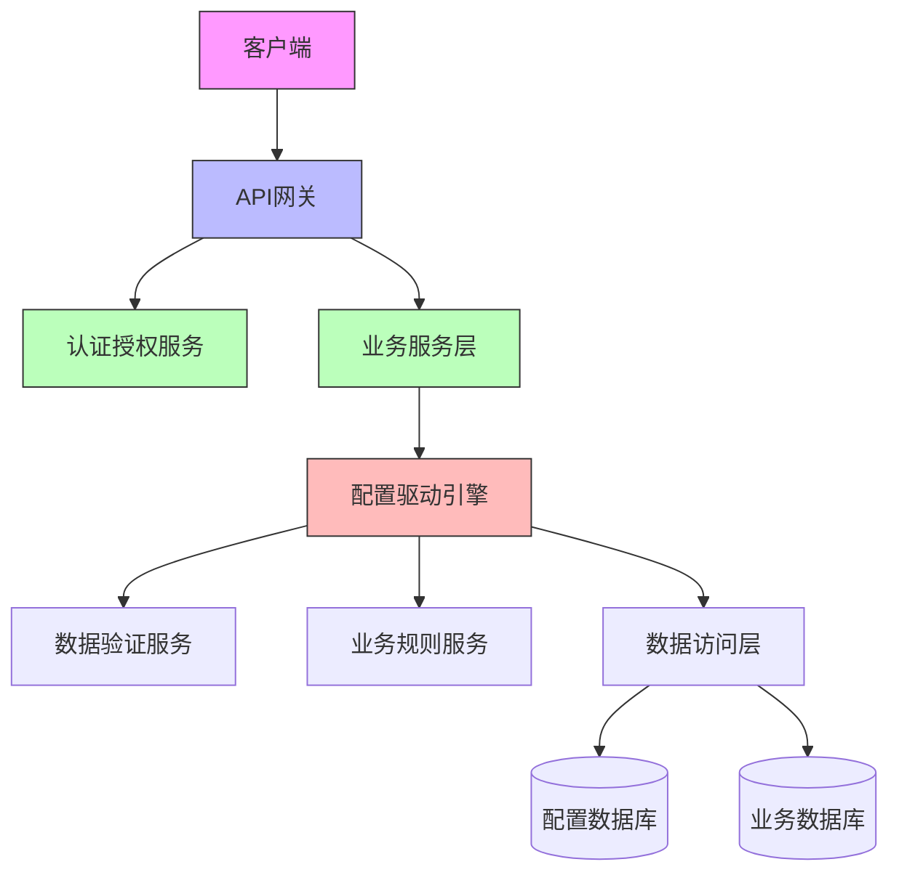
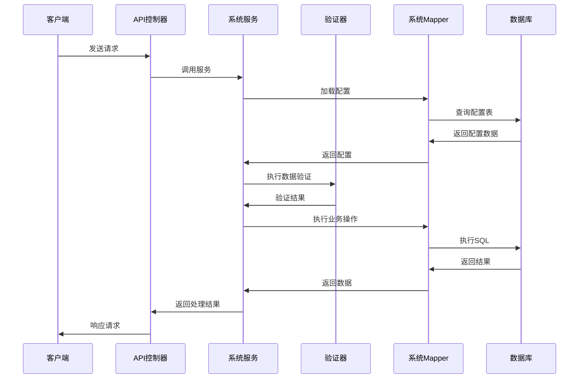

# 配置驱动型后端服务系统架构

## 状态: 已批准

## 技术摘要

本项目是一个配置驱动型后端服务系统，通过"数据驱动一切"的理念，创建高度灵活、易维护且功能强大的后端服务。系统采用配置化方式驱动业务逻辑和数据库操作，最大限度减少硬编码，提高系统可维护性和扩展性。核心设计理念是将业务规则、数据验证和界面展示等逻辑从代码中分离出来，存储在数据库配置表中，实现动态调整系统行为而无需修改代码。

## 技术选型表

| 技术        | 描述                                       |
| ----------- | ------------------------------------------ |
| Java 17     | 主要开发语言，利用其稳定性和丰富的生态系统 |
| Spring Boot | 应用框架，简化配置和开发流程               |
| MyBatis     | ORM框架，用于数据库访问和操作              |
| MySQL 8.0   | 关系型数据库，存储业务数据和配置信息       |
| Redis       | 缓存服务，提高系统性能和响应速度           |
| JWT         | 用户认证和授权机制                         |
| Maven       | 项目构建和依赖管理工具                     |
| AOP         | 面向切面编程，用于实现拦截器和日志记录     |
| Lombok      | 简化Java代码，减少样板代码                 |
| Swagger     | API文档生成工具                            |

## 架构图

### 系统整体架构



### 配置驱动流程



## 数据模型

### 配置表结构

#### 表属性配置(table_attribute)

```sql
CREATE TABLE IF NOT EXISTS `table_attribute` (
  `tableName` varchar(100) COMMENT '数据库中文表名',
  `dbtable` varchar(100) NOT NULL COMMENT '数据库表名',
  `sort` varchar(200) COMMENT '排序内容',
  `functions` varchar(100) COMMENT '功能模块',
  `primaryKey` varchar(100) COMMENT '主键',
  `isTree` tinyint(1) DEFAULT 0 COMMENT '是否树形结构',
  `treeParentField` varchar(100) COMMENT '树形父字段',
  `treeChildField` varchar(100) COMMENT '树形子字段',
  PRIMARY KEY (`dbtable`)
);
```

#### 字段属性配置(column_attribute)

```sql
CREATE TABLE column_attribute (
    id int NOT NULL AUTO_INCREMENT,
    dbTableName varchar(100) NOT NULL COMMENT '数据库表名',
    name varchar(100) NOT NULL COMMENT '字段名称',
    pagename varchar(100) COMMENT '名称',
    IsShowInList tinyint(1) DEFAULT 0 COMMENT '列表显示',
    IsShowInSearch tinyint(1) DEFAULT 0 COMMENT '搜索显示',
    IsShowInAdd tinyint(1) DEFAULT 0 COMMENT '添加显示',
    IsShowInEdit tinyint(1) DEFAULT 0 COMMENT '编辑显示',
    IsShowInDetail tinyint(1) DEFAULT 0 COMMENT '详情显示',
    controlType varchar(50) COMMENT '控件类型',
    dataSource varchar(255) COMMENT '数据源',
    PRIMARY KEY (id)
);
```

#### 字段校验配置(column_check_property)

```sql
CREATE TABLE column_check_property (
    id int NOT NULL AUTO_INCREMENT,
    check_table VARCHAR(50) NOT NULL COMMENT '检查表名',
    check_column VARCHAR(50) NOT NULL COMMENT '列名',
    check_mode VARCHAR(50) NOT NULL COMMENT '检查模式',
    check_param VARCHAR(255) COMMENT '检查参数',
    errorMsg VARCHAR(255) NOT NULL COMMENT '错误信息',
    PRIMARY KEY (id)
);
```

### API规范

#### 通用请求格式

```json
{
  "targetTable": "表名",
  "data": {
    "字段1": "值1",
    "字段2": "值2"
  },
  "condition": {
    "字段": "条件值"
  },
  "page": 1,
  "pageSize": 10,
  "orderBy": "字段 ASC/DESC"
}
```

#### 通用响应格式

```json
{
  "code": 200,
  "message": "操作成功",
  "data": {
    // 响应数据
  },
  "timestamp": 1647856390123
}
```

## 项目结构

```
/
├── /src/main/java/com/ycbd/demo
│   ├── /config           # 配置类
│   ├── /controller       # 控制器层
│   │   ├── CommonController.java  # 通用CRUD控制器
│   │   └── TestController.java    # 测试控制器
│   ├── /service          # 服务层
│   │   ├── SystemService.java     # 系统服务接口
│   │   └── impl                   # 服务实现
│   ├── /mapper           # 数据访问层
│   │   └── SystemMapper.java      # 系统数据访问接口
│   ├── /model            # 数据模型
│   │   ├── entity                 # 实体类
│   │   ├── dto                    # 数据传输对象
│   │   └── vo                     # 视图对象
│   ├── /interceptor      # 拦截器
│   │   └── ServiceInterceptorAspect.java  # 服务拦截切面
│   ├── /exception        # 异常处理
│   │   ├── GlobalExceptionHandler.java    # 全局异常处理器
│   │   └── AuthenticationException.java   # 认证异常
│   ├── /util             # 工具类
│   └── DemoApplication.java  # 应用入口
├── /src/main/resources
│   ├── /mapper           # MyBatis映射文件
│   │   └── SystemMapper.xml       # 系统Mapper映射
│   ├── application.yml   # 应用配置
│   └── /static           # 静态资源
├── /src/test             # 测试代码
└── pom.xml               # 项目依赖管理
```

## 变更日志

| 变更             | 故事ID   | 描述                                     |
| ---------------- | -------- | ---------------------------------------- |
| 初始架构设计     | PROJ-001 | 初始系统架构设计和文档                   |
| 添加配置驱动引擎 | PROJ-002 | 实现基于数据库配置的业务逻辑驱动机制     |
| 集成JWT认证      | PROJ-003 | 添加基于JWT的用户认证和授权机制          |
| 实现通用CRUD接口 | PROJ-004 | 开发通用的增删改查接口，支持动态表操作   |
| 添加数据验证框架 | PROJ-005 | 实现基于配置的数据验证框架               |
| 添加全局异常处理 | PROJ-006 | 实现统一的异常处理机制                   |
| 添加AOP拦截器    | PROJ-007 | 实现服务层拦截器，用于日志记录和权限控制 |
| 优化缓存机制     | PROJ-008 | 添加Redis缓存支持，提高系统性能          |
